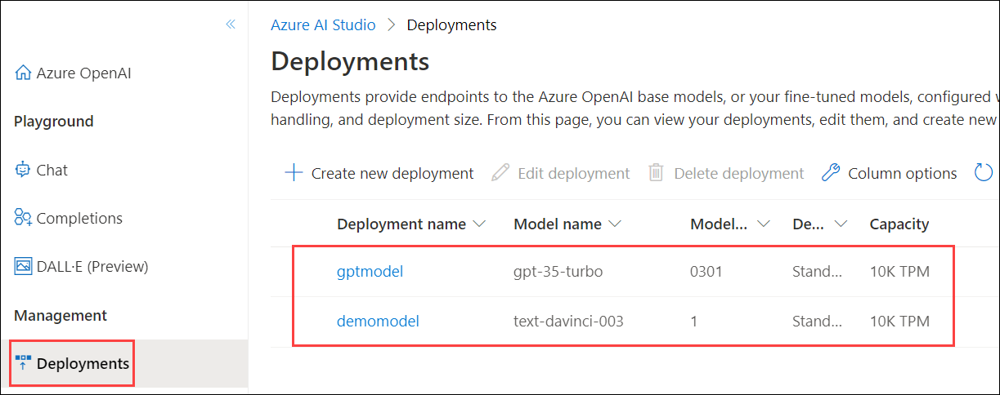
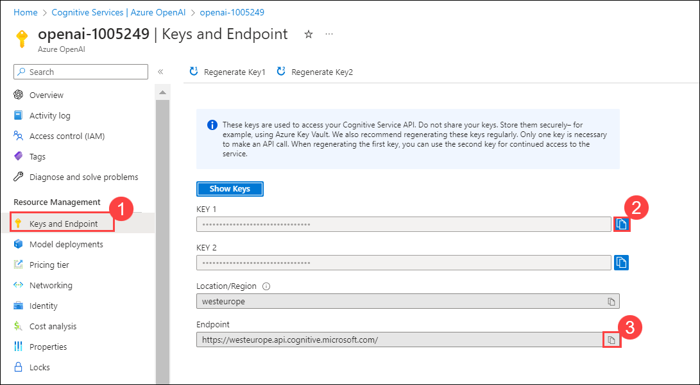

# Exercise 1: Getting Started with Azure OpenAI

In this exercise, you will create a deployment and model in Azure OpenAI studio which you will be using in further exercises.
   
## Task 1: Deploy Azure OpenAI Model.

1. In the **Azure portal**, search for **OpenAI** and select **Azure OpenAI**.

   

1. On **Cognitive Services | Azure OpenAI** blade, select **openai-<inject key="DeploymentID" enableCopy="false"/>**

   

1. In the Azure OpenAI resource pane, click on **Go to Azure OpenAI Studio** it will navaigate to **Azure AI Studio**.

   

1. In the **Azure AI Studio**, select **Deployments** under Management and verify that two models with the corresponding **Deployment names** of **gptmodel** and **demomodel** are present and the capacity of the model is set to **10K TPM**.

   

1. Naviagte back to [Azure portal](http://portal.azure.com/), search and select **Azure OpenAI**, from the **Cognitive Services | Azure OpenAI pane**, select the **OpenAI-<inject key="Deployment ID" enableCopy="false"/>**.

1. On **openai-<inject key="DeploymentID" enableCopy="false"/>** blade, select **Keys and Endpoint (1)** under **Resource Management**. Copy **Key 1 (2)** and the **Endpoint (3)** by clicking on copy to clipboard paste it in a text editor such as notepad for later use. 

   

