# Build Open AI Application on Power App to allow users to use natural language question on top of SQL data
### Summary.

This scenario allows users to use Open AI as an intelligent agent to get business questions prompts from end users and generating SQL queries from the prompts.This implementation scenario focuses on building a Natural Language to query from business questions and generate the queries for database retrieval 
### Architecture Diagram
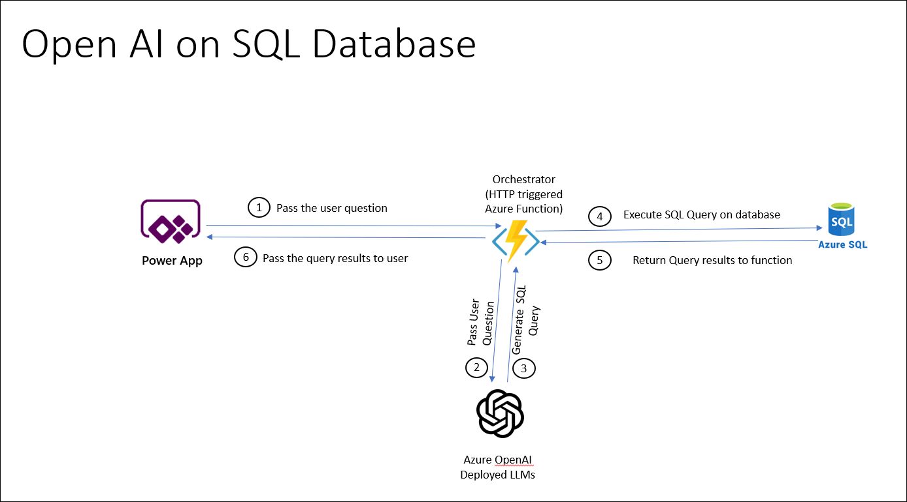


### Solution Flow

Step 1: Context information is provided to system through a Power App form, this information is submitted to Azure function

Step 2: Azure Open AI engine converts the user context prompt to SQL query and passes the query to Azure function

Step 3: Azure function passes the context information to Open AI Engine to convert the user context information prompt to SQL Query

Step 4: The Azure function passes the generated SQL query text and executes the query on Azure SQL database 

Step 5: The query is executed on SQL database and results are returned to Azure function

Step 6: Azure function returns the results to end user 
### Azure services deployment
   
## Step1: Configure Azure Function App

1. Open func-config.txt in scenarios/natural_language_query/azurefunc folder and provide the Open AI engine, Open AI rest end point, SQL server and SQL database name

1. Go to deployed function and click "Configuration" -> "Application Settings" and click on "Advance edit" and copy the "func-config.txt" values in the editor. DO not delete the existing contents in "Advance edit", just update ""config-func.txt" values before the last line and ']' mark. After copying the values click "OK" and "Save"

   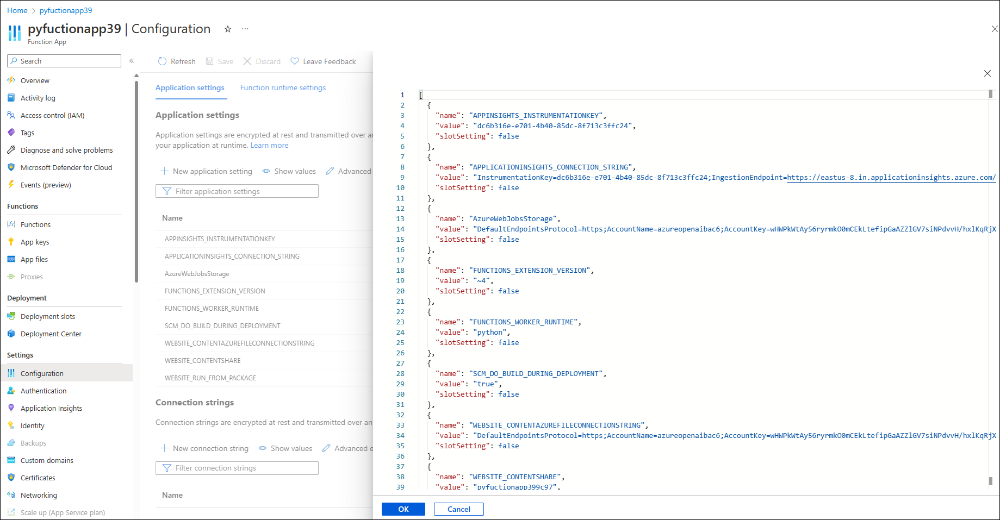


1. Under Settings in function click on "Identity" , under "System assigned" set the "Status" to "On", Save the changes

   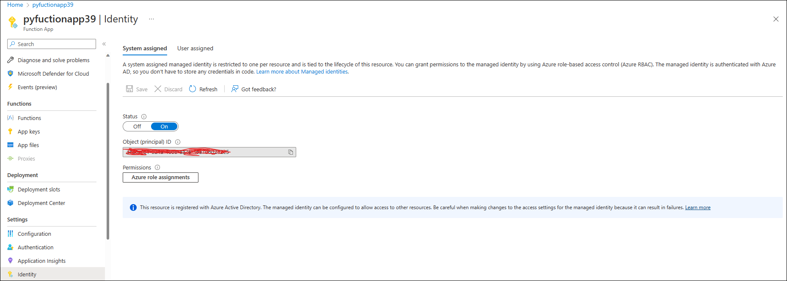

1. Go to SQL server, under "settings", click "Azure Active Directory" and click "Set admin", on right side provide the name of function app which you have provided in point b. Add the name and click  "Select" and "Save"

   


## Step 2. Test the function App

1. Go to **functionapp<inject key="Deployment ID"></inject>** function app from **openai-<inject key="Deployment ID"></inject>** resource group.

   

2. Then click **Functions** and click deployed function **NLQuery**.

   

3. From **NLQuery** go to **Code + Test (1)**, then click **Test/Run (2)** select "GET (3)" in **HTTP method** dropdown, click **+** under to **Query** and enter **prompt (4)** in Name field and **show top 10 products (5)** in value field. Click **Run (6)**.

   

4. The **Output** tab will have the query results. 

   
  
   >**Note:** Please press the Run again if the output tab does not print the records


## Step 3. Deploy client Power App

1. Navigate to https://make.powerapps.com/. On **Welcome to Power Apps** select your **Country/Region** click **Get Started**. 

   
    
2. Select **Apps** on the left navigation and click **Import Canvas App**. 

    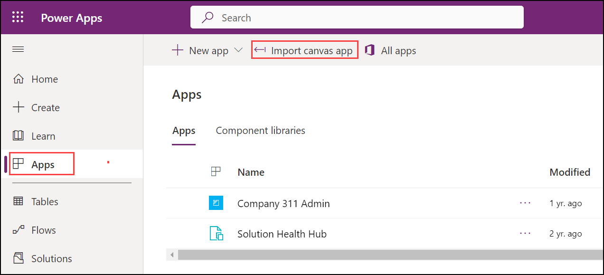

3. On **Import package** page click on **Upload**.

    

4. From the flie explorer navigate to `C:\labfile\OpenAIWorkshop-main\scenarios\natural_language_query` select the **NLQuery PowerApp Export** folder **Open**.

     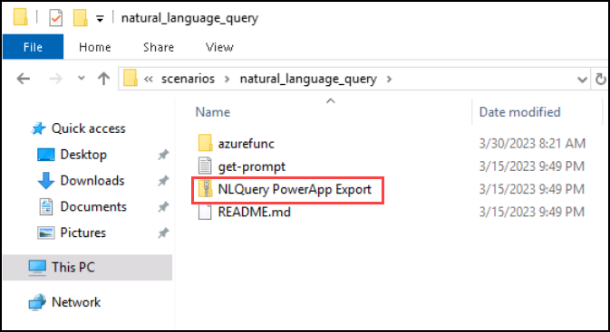

5. Click on **Import** to import the package into powerapps environment. This will import the Power App canvas app and Power Automate Flow into the workspace. 

    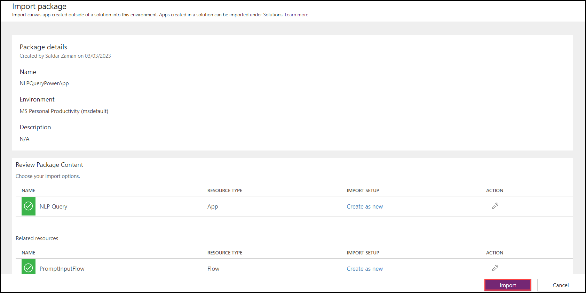

6. Navigate back **functionapp<inject key="Deployment ID"></inject>** function app on the azure portal from **openai-<inject key="Deployment ID"></inject>** resource group.

   

7. Then click **Functions** and click deployed function **NLQuery**.

   

8. On the **NLQuery** function click on **Get Function Url (1)**, from the drop-down menu select **default (function key) (2)** then **Copy (3)** the URL. Click **OK (4)**. Paste the URL in a text editor such as _Notepad_ for later use.

    

9. Back on the PowerApps, select the **Flows** Pane, click on **Edit** for **PromptlnputFlow**.

    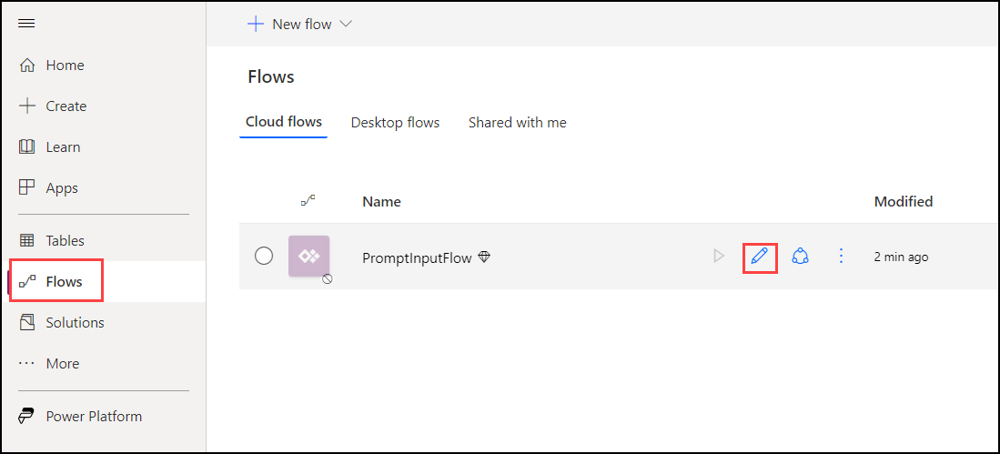
 
10. Edit the Power Automate Flow and update **Azure Function Url** with the URL you copied earlier and append `prompt=` at the end. Your URL should look similar to the following. Click **Save**.

    ```
    https://functionappXXXXXX.azurewebsites.net/api/NLQuery?prompt=
    ```
  
   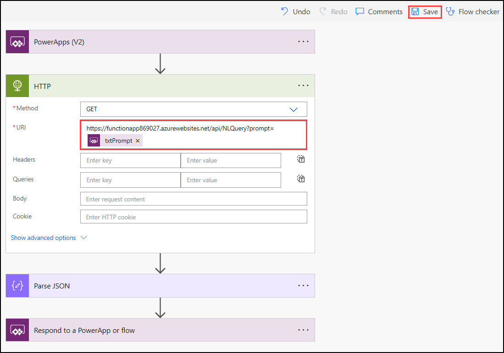


11. Run the App by clicking on the App

   

   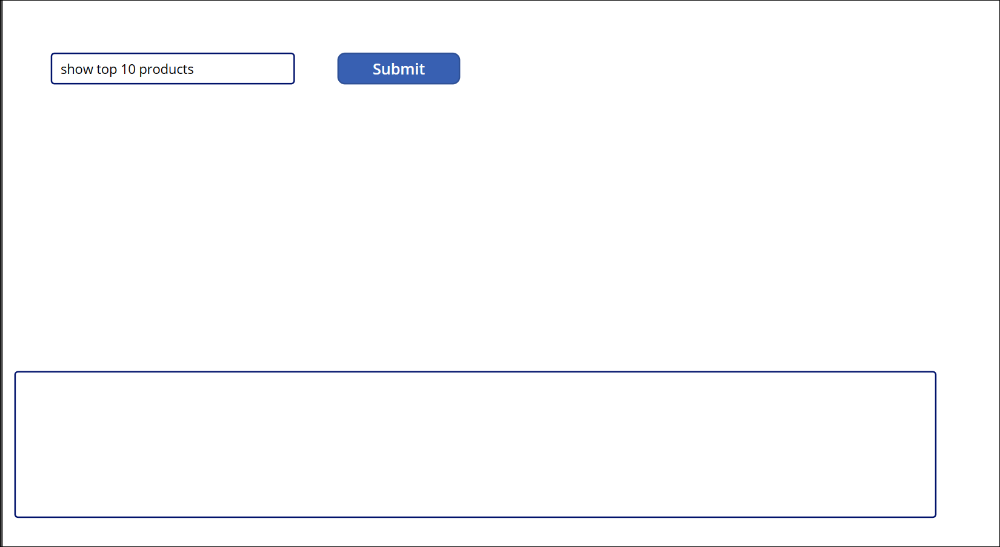


## Step 4. Build the Connector App (Optional)

1. Navigate to https://make.powerapps.com/ and click on **App launcher** on the top left corner and select **Power Automate**.


   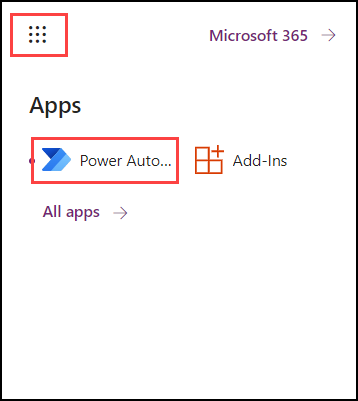


2.  Click on **Data (1)** and select **Custom Connectors (2)**, click on **+ New custom connector (3)** then click on **Create from blank (4)**. Just keep the screen as is and move to the next step.

    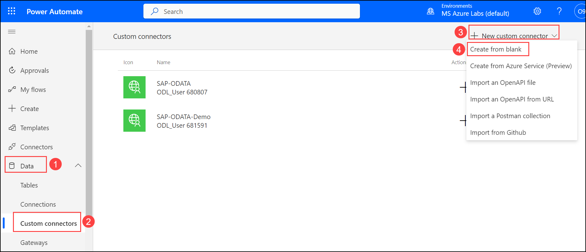

3.  Go to `C:\labfile\OpenAIWorkshop-main\scenarios\natural_language_query` and open "get-prompt.txt". We need to update below values in file 

    host : <funcname>.azurewebsites.net
  
    paths :  /api/NLQuery
  
    operationId: Get-Prompt 

    
   

  
  >**Note:** host and paths are extracted from your function url and can be retrieved from  below screen. Host should not have "Https", please note operationid needs to be unique per powerapps account

    
   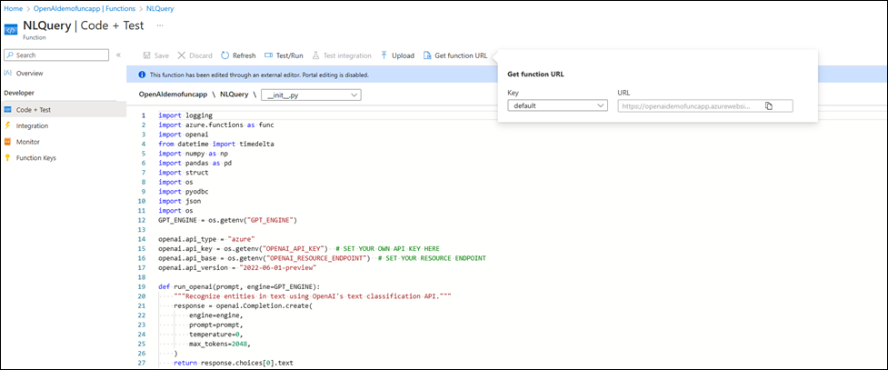


1. In the Custom connector app browser tab , (step b), click on “Swagger Editor” and copy the updated file contents (step c.) in the swagger editor. Click Close to save the Connector


   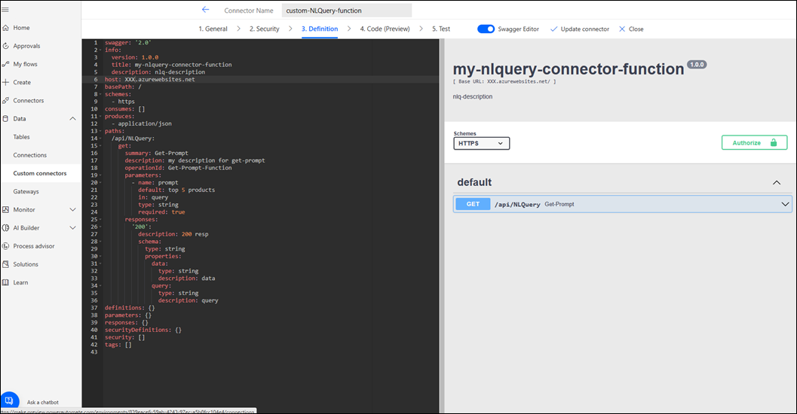
   
1. Navigate to https://make.powerapps.com and click Click on “My Flows” and select the flow which you imported in previous step 4 (d) and click “Edit”

   

1. We will update the power automate flow second step after PowerApps(V2), click on + and select “Add an action”
  
   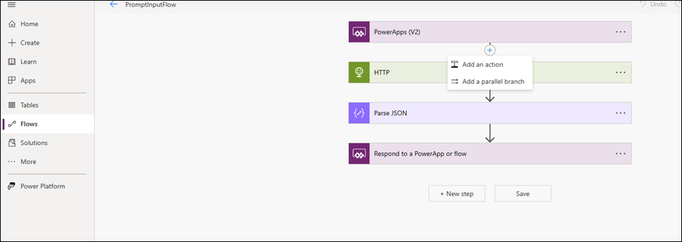
  
1. Select Custom and type and search for custom connector which we created in step d.
  
   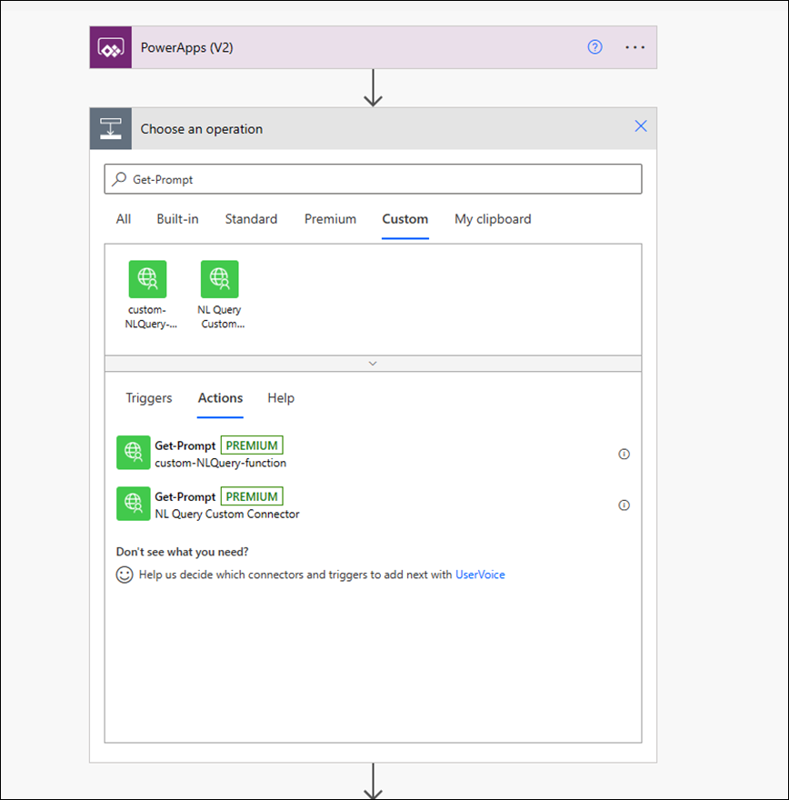

1. The flow will look like below
  
   
  
1. You need to delete the third step which in your case will be “HTTTP” flow, after deleting the third step, click Save

   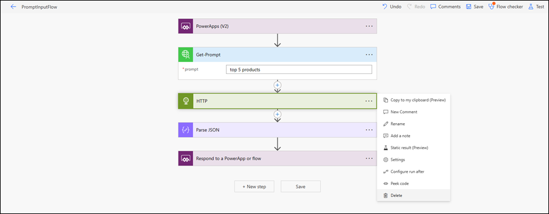

   
  
1. Click Parse JSON step , click inside "Content" field, click on right side and select “body" . The Control should like the below
  
   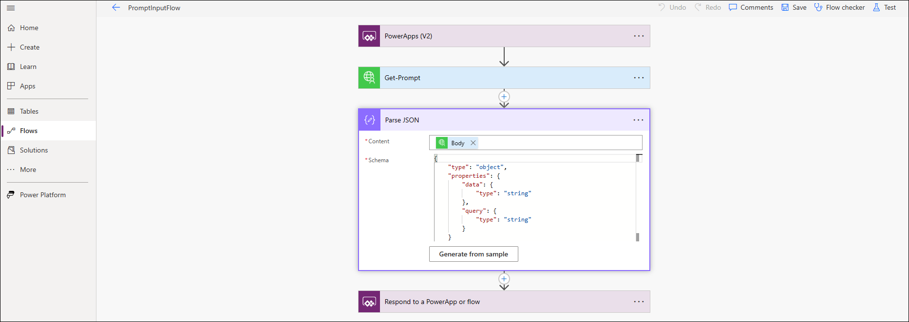
  
1. click on Test, select Manually and make sure "txtPrompt" in selected in *prompt field, click Run. It will show "Your flow run successfully started. To monitor it, go to the Flow Runs Page." Save the flow

   


1. go to app which we imported in step 4 and click Edit
  
   

1. Click on Power Automate,  once Power Automate opens click refresh and click save on right top side. 

   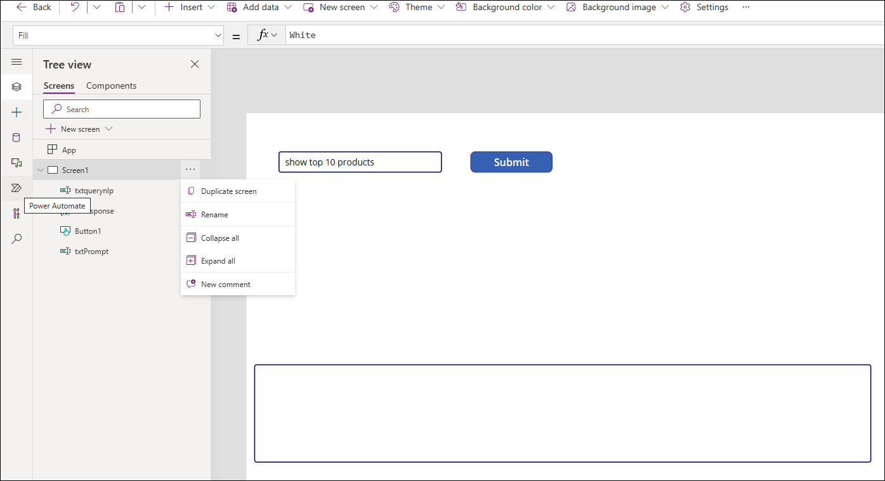
  
   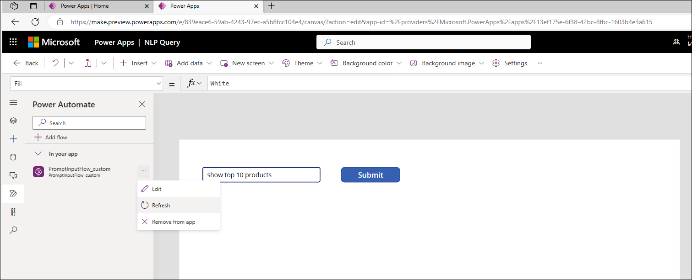

1. please run the App
  
## Step 5. Test the Power App

1. Navigate to https://make.powerapps.com/ and click on Apps on the left navigation.

1.  Search the App which you deployed in step 4 and and click it 

    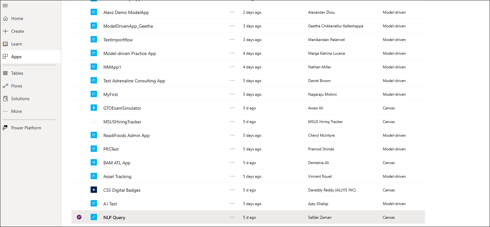


    


