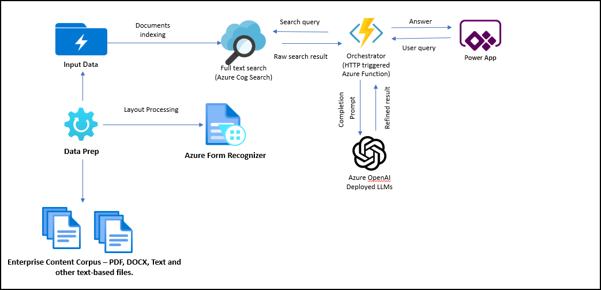
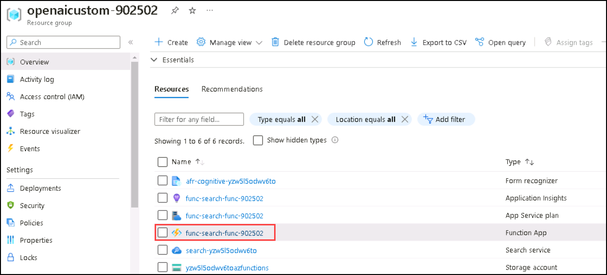
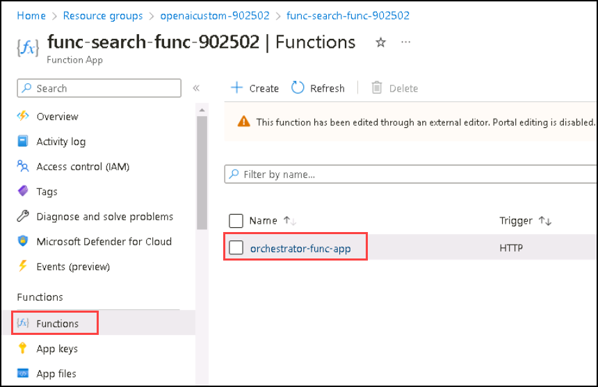
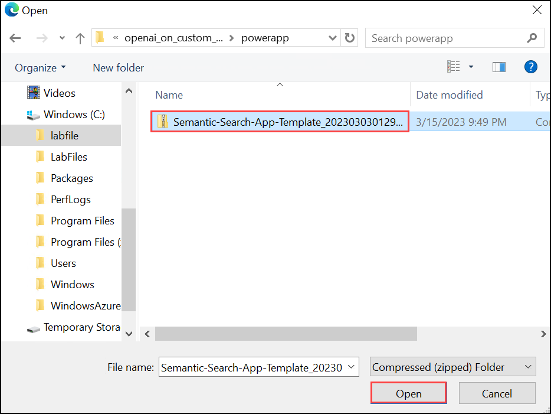
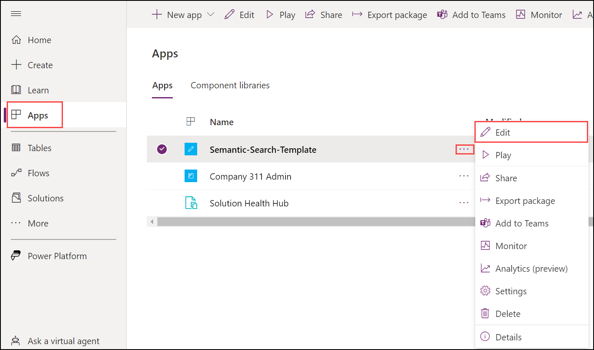
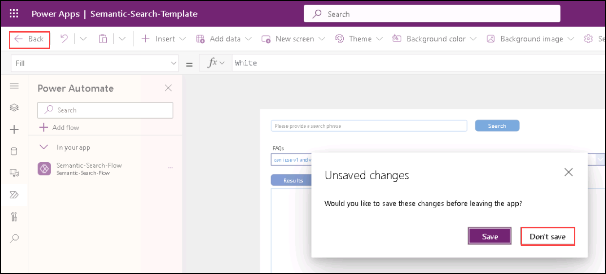
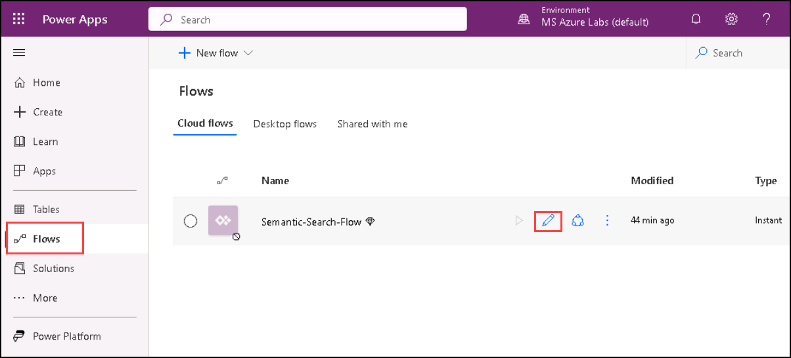
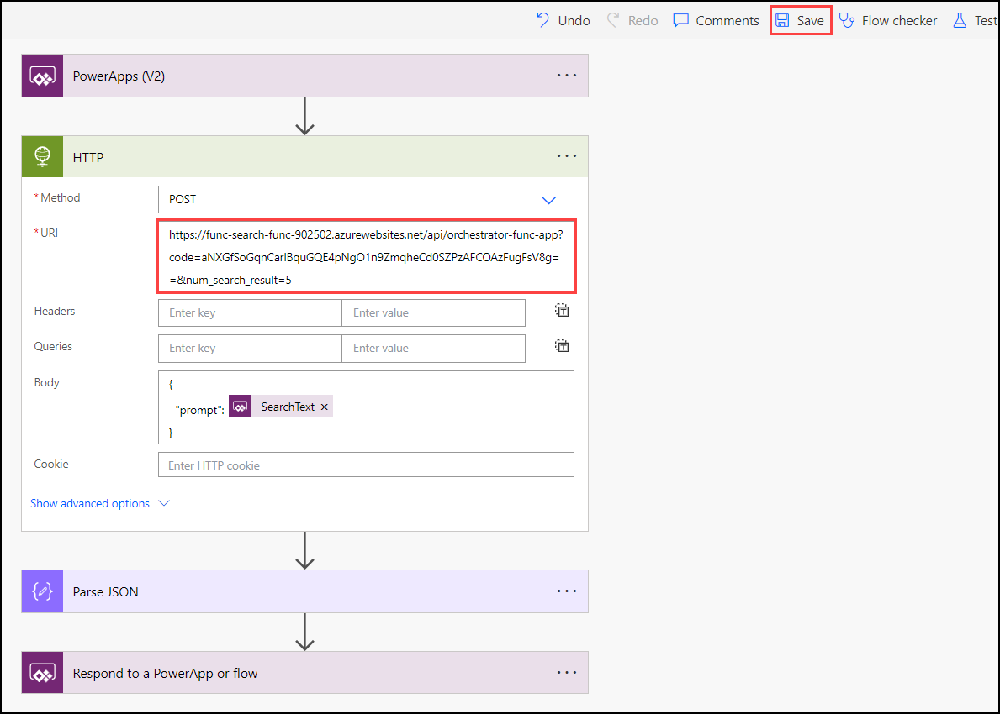

# Using Azure OpenAI on custom dataset
### Scenario summary:
This scenario allows use cases to use Open AI as an intelligent agent to answer questions from end users or assist them using knowledge of a proprietary corpus and domain.
Applications can be: 
- Giving direct answer to questions about specific product, service and process based on a knowledge corpus that can be updated frequently. This is an alternative to classic search where the result are just documents with relevant information to the question. Think of this as Bing Chat on proprietary data.
- Giving recommendation & assistance: based on information that can be implicitly gathered about the user, formulate useful content for the user's purpose. For example, a travel website may utilize users' personal information, past posts and transaction history to personalize recommendations when users need to be helped with creating next trip idea/itinerary

Regardless of the application scenario, the solution flow is:
- Step 1 prepare the context information: context information can be retrieved from proprietary knowledge corpus and other systems based on the user's query and user's information. The retrieval mechanism can be a semantic search engine to retrieve right content for unstructured data corpus or SQL query in case of structured dataset.
- Step 2 fomulate prompt to Open AI: from the context and depending on the goal of user, formulate GPT prompt to get the final response to end user. For example, if it's knowlege retrieval vs. recommendation

This implementation scenario focuses on building a knowledge retrieval chatbot application on top of unstructured data corpus but the same design can be used for recommendation & generative scenarios.

### Architecture Diagram



From the user's query, the solution uses two-stage information retrieval to retrieve the content that best matches the user query. 
In stage 1, full text search in Azure Cognitive Search is used to retrieve a number of relevant documents. In stage 2, the search result is applied with pretrained NLP model and embedding search to further narrow down the the most relavant content. The content is used by orchestrator service to form a prompt to OpenAI deployment of LLM. The OpenAI service returns result which is then sent to Power App client application.

# PowerApp


1. In the [Azure portal](https://portal.azure.com), navigate to **func-search-func-<inject key="Deployment ID"></inject>** function app from **openaicustom-<inject key="Deployment ID"></inject>** resource group.

   

2. From the **Function app** go to **Functions** on the left menu and select **orchestrator-func-app**.

   
   
3. On the **orchestrator-func-app** function click on **Get Function Url (1)**, from the drop-down menu select **default (function key) (2)** then **Copy (3)** the URL. Click **OK (4)**. Paste the URL in a text editor such as _Notepad_ for later use.

    

4. Navigate to https://make.powerapps.com/ and login using your user credentials. On **Welcome to Power Apps** select your **Country/Region** click **Get Started**. 

   
    
5. Select **Apps** on the left navigation and click **Import Canvas App**. 

    

6. On **Import package** page click on **Upload**.

    
    
7. Navigate to `C:\labfile\OpenAIWorkshop-main\scenarios\openai_on_custom_dataset\powerapp` and select `Semantic-Search-App-Template_20230303012916.zip` folder then click **Open**.

   
   
8. Click on **Import** to import the package into powerapps environment.

    

9. Once the import is completed, Click on Apps then click on **...** next to **Semantic-Search-Template** and click on **Edit**.

    
     

10. Click on **Power Automate** This will import the Power App canvas app and Semantic-Search Power Automate Flow into the workspace. 

    

11. To navigate back click on **Back** then click **Don’t save** .

    

12. Next select the **Flows** Pane, click on **Edit**. PowerAutomate Flow needs to be enabled. At this point, the powerapp can be run as is. It connects to a pre-built Azure Function App. 

    

13. Edit the Power Automate Flow and update **Azure Function Url** with the URL you copied earlier and append `&num_search_result=5` at the end. Your URL should look similar to the following. Click **Save**.

    ```
    https://func-search-func-XXXXX.azurewebsites.net/api/orchestrator-func-app?code=aNXGfSoGqnCarlBquGQE4pNgO1n9ZmqheCd0SZPzAFCOAzFugFsV8g==&num_search_result=5
    ```
    
    
