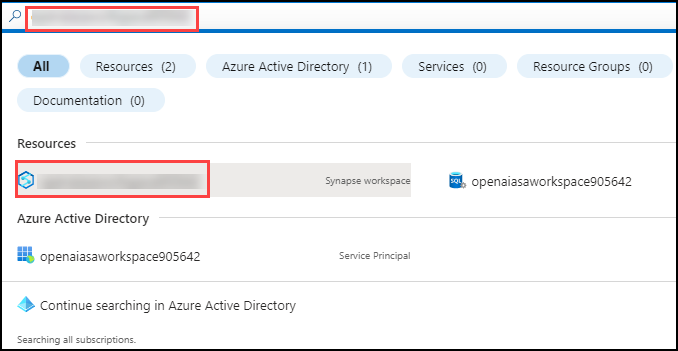
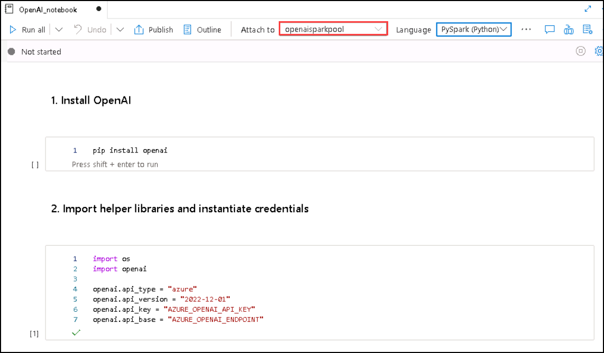
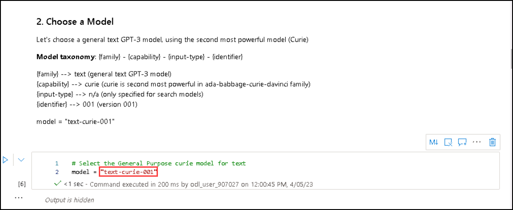
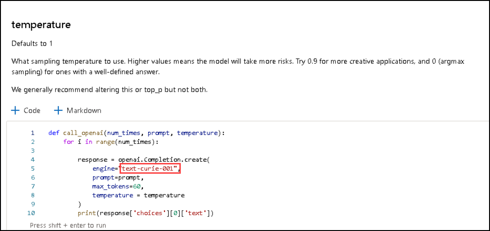
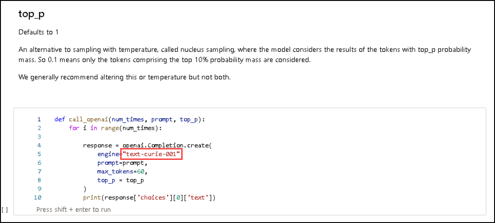
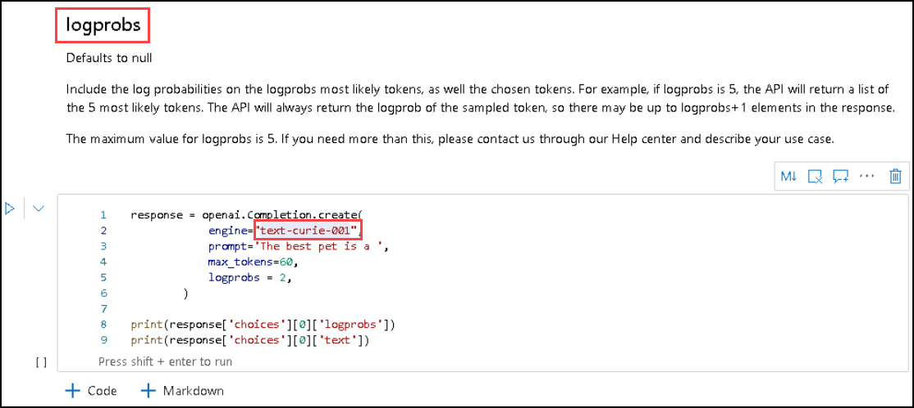
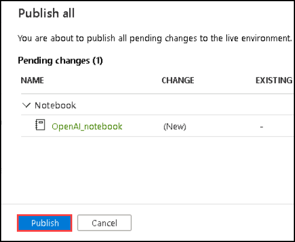

 1. Go to <https://portal.azure.com> and sign in with your organizational account. In the search box at the top of the portal, search for your workspace
    and click on the Synapse workspace which appears under the Resources section.

      

1.  On the **Overview** blade under **Getting started** section, click **Open** to open Synapse Studio.
     
    
    
1. Select **openaisparkpool** from the drop-down menu of **Attach to**.

    

1. Run the notebook it step by step to complete this exercise. Click on **Run** button next to the cell. 

     

1. In **2. Import helper libraries and instantiate credentials** replace the **AZURE_OPENAI_API_KEY** and **AZURE_OPENAI_ENDPOINT** with your API key and End point URL.

    

1. For **2. Choose a Model**, replace **model** value from **text-curie-001** to **demomodel**.

    

1. In **temperature**, replace **engine** value from **text-curie-001** to **demomodel**.

     

1. In **top_p**, replace **engine** value from **text-curie-001** to **demomodel**.

     

1. For **n**, replace **engine** value from **text-curie-001** to **demomodel**.

     

1. In **logprobs**, replace **engine** value from **text-curie-001** to **demomodel**.

     

1. After running the notebook successfully, click on **Publish all**.

     

1. Then click **Publish**. 

    
